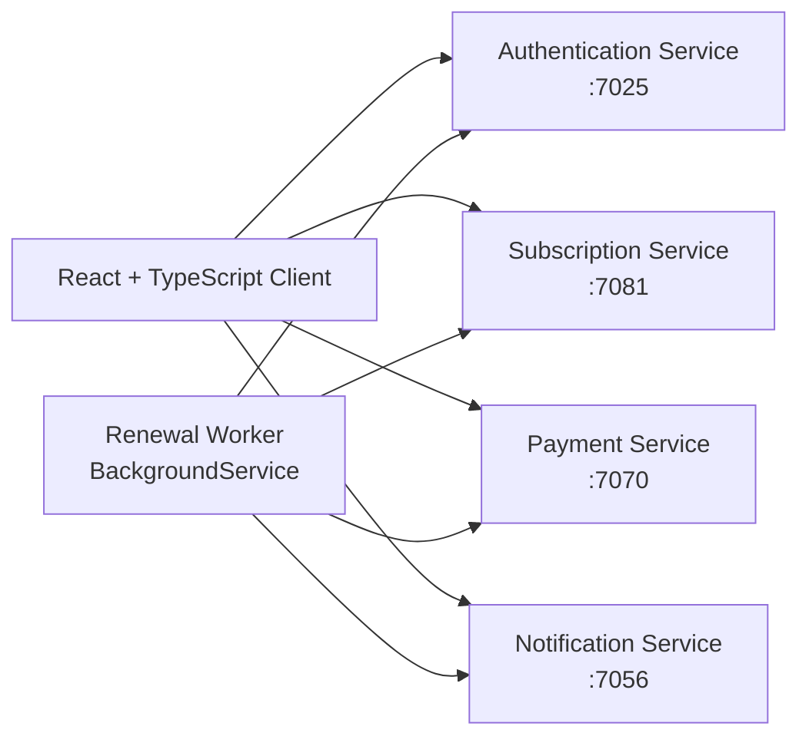
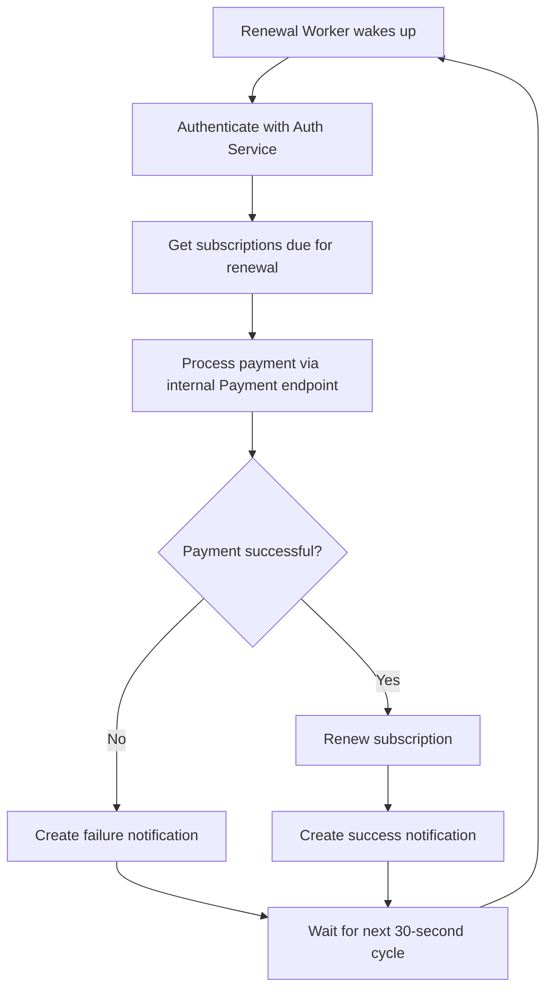
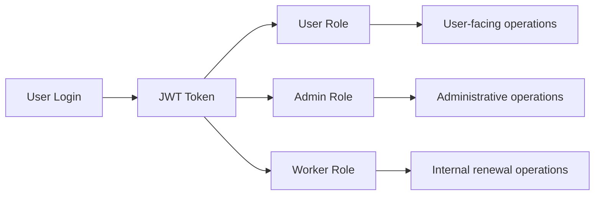

# 🚀 SubTrack

> **A full-stack subscription management platform with automated recurring payments, role-based access control, notifications, and a dedicated renewal worker.**

SubTrack is built with **React + TypeScript** on the frontend and a **multi-service ASP.NET Core backend**. The project demonstrates how independent backend responsibilities can be separated into services while a dedicated background worker coordinates recurring billing.

<p align="center">
  
  
  
  
  
</p>

---

## ✨ Why SubTrack?

SubTrack goes beyond basic CRUD by combining **authentication, authorization, subscription lifecycle management, payment processing, notifications, and automated background processing** into one working system.

### What makes it interesting?

- 🔐 **JWT authentication + role-based authorization** for `User`, `Admin`, and `Worker`
- 🧩 **Four ASP.NET Core API services** with clear responsibilities
- ⚙️ **Dedicated BackgroundService** for automated recurring renewals
- 💳 **Internal payment flow** designed specifically for the renewal worker
- 🔔 **Notification workflow** for successful and failed renewals
- 🗄️ **Entity Framework Core + SQL Server** with service-specific data contexts
- 🔄 **Service-to-service HTTP communication** using `IHttpClientFactory`
- 🧪 **Postman collection** for exploring and testing the APIs

---

## 🏗️ Architecture

The system consists of a React client, four ASP.NET Core API services, and a dedicated background worker.



### Service responsibilities

| Component | Port | Responsibility |
|---|---:|---|
| **Authentication Service** | `7025` | Registration, login, JWT authentication, profiles, passwords, and user/role administration |
| **Subscription Service** | `7081` | Subscription CRUD, lifecycle/status management, categories, due-subscription detection, and renewals |
| **Payment Service** | `7070` | Payment processing, payment lookup, and transaction history |
| **Notification Service** | `7056` | User notifications, unread counts, read/unread management, and admin notification management |
| **Renewal Worker** | — | Background orchestration for recurring subscription renewals |

> **Note:** The Renewal Worker is a background orchestration component, not a public HTTP API service.

---

## 🔄 Automated Renewal Workflow

One of the core features of SubTrack is its automated recurring-payment workflow.



The worker is implemented with `BackgroundService` and uses `IHttpClientFactory` for service-to-service HTTP communication. It obtains a JWT, checks for due subscriptions, calls the internal payment endpoint, creates notifications, and renews successfully paid subscriptions.

The worker polls every **30 seconds** and supports graceful cancellation through `CancellationToken`.

---

## 🔐 Authorization Model

SubTrack uses JWT authentication together with role-based authorization.



### Role examples

| Role | Typical responsibilities |
|---|---|
| **User** | Manage profile, subscriptions, payments, and notifications |
| **Admin** | Manage users/roles and access system-wide administrative data |
| **Worker** | Execute internal renewal, payment, and notification operations |

---

## 💡 Key Features

### Authentication & User Management

- User registration and login
- JWT-based authentication
- User profile retrieval and updates
- Password changes
- Admin user listing
- Admin role management

### Subscription Management

- Create and update subscriptions
- View individual subscriptions
- View the authenticated user's subscriptions
- Admin access to all subscriptions
- `Active`, `Paused`, and `Cancelled` statuses
- Monthly and yearly billing cycles
- Subscription categories
- Next billing date tracking
- Due-subscription detection
- Worker-driven subscription renewal
- Admin subscription deletion

### Payments

- User-initiated payment processing
- Worker-only internal payment processing
- Payment lookup by ID
- Payment history by subscription
- User transaction history
- Admin access to all payments

### Notifications

- Create notifications from the renewal workflow
- View current user's notifications
- Unread notification count
- Mark individual notifications as read
- Mark all notifications as read
- Admin notification management

---

## 📡 API Overview

The backend currently exposes **30 controller endpoints** across authentication, user management, subscriptions, payments, and notifications.

<details>
<summary><strong>View all endpoints</strong></summary>

### Authentication — `/auth`

| Method | Endpoint | Purpose |
|---|---|---|
| POST | `/auth/register` | Register a new user |
| POST | `/auth/login` | Authenticate a user |

### User Management — `/user`

| Method | Endpoint | Purpose |
|---|---|---|
| GET | `/user/profile` | Get authenticated user's profile |
| PATCH | `/user/update` | Update authenticated user's profile |
| PATCH | `/user/changepassword` | Change authenticated user's password |
| GET | `/user/alluser` | Admin: list users |
| PATCH | `/user/role/{userId}` | Admin: update a user's role |

### Subscriptions — `/subscription`

| Method | Endpoint | Purpose |
|---|---|---|
| POST | `/subscription/create` | Create a subscription |
| PATCH | `/subscription/update/{subscriptionId}` | Update a subscription |
| GET | `/subscription/all` | Admin: list all subscriptions |
| GET | `/subscription/{subscriptionId}` | Get a subscription by ID |
| GET | `/subscription/user-subscription` | Get current user's subscriptions |
| PUT | `/subscription/status/{subscriptionId}/{status}` | Update subscription status |
| DELETE | `/subscription/{subscriptionId}` | Admin: delete a subscription |
| PATCH | `/subscription/renew/{subscriptionId}` | Worker: renew a subscription |
| GET | `/subscription/due` | Worker/Admin: get subscriptions due for renewal |
| GET | `/subscription/categories` | Get available subscription categories |

### Payments — `/payment`

| Method | Endpoint | Purpose |
|---|---|---|
| POST | `/payment/process` | Process a user payment |
| POST | `/payment/processinternal` | Worker: process an internal payment |
| GET | `/payment/{paymentId}` | Get a payment by ID |
| GET | `/payment/subscription/{subscriptionId}` | Get payments for a subscription |
| GET | `/payment/transactions` | Get user's transaction history |
| GET | `/payment/all` | Admin: list all payments |

### Notifications — `/notification`

| Method | Endpoint | Purpose |
|---|---|---|
| POST | `/notification/create` | Worker: create a notification |
| GET | `/notification/my` | Get current user's notifications |
| PATCH | `/notification/readall` | Mark all notifications as read |
| PATCH | `/notification/read/{notificationId}` | Mark a notification as read |
| GET | `/notification/unreadcount` | Get unread notification count |
| DELETE | `/notification/delete/{notificationId}` | Admin: delete a notification |
| GET | `/notification/all` | Admin: list all notifications |

</details>

---

## 🧰 Tech Stack

### Backend

- **C# / ASP.NET Core**
- **Entity Framework Core**
- **ASP.NET Identity**
- **JWT Authentication**
- **Role-Based Authorization**
- **SQL Server**
- **BackgroundService**
- **IHttpClientFactory**

### Frontend

- **React**
- **TypeScript**
- **Axios**
- **React Hook Form**

### Development & Testing

- **Postman**
- **PowerShell**
- **EF Core Migrations**

---

## 📁 Project Structure

```text
Subtrack/
├── Client/                         # React + TypeScript frontend
│   └── src/
│       └── Services/               # Axios API clients
│
├── Server/
│   ├── Authentication/             # Authentication & user management
│   ├── Subscriptions/              # Subscription management
│   ├── Payments/                   # Payment processing
│   ├── Notifications/              # Notification management
│   ├── RenewalWorker/              # Automated renewal background worker
│   ├── Substack.slnx
│   └── run-all.ps1                 # Starts all backend components
│
└── Subtrack.postman_collection.json # API testing collection
```

---

## 🚀 Getting Started

### Prerequisites

- .NET SDK 8.0 or later
- Node.js 18+ and npm
- SQL Server
- Postman (optional, for API testing)

### 1. Clone the repository

```bash
git clone https://github.com/chauhan12harsh/Subtrack.git
cd Subtrack
```

### 2. Build the backend

```bash
cd Server
dotnet restore
dotnet build
```

Run the backend components individually from their project directories, or start them together with:

```powershell
cd Server
.\run-all.ps1
```

Before starting the Renewal Worker, configure the service endpoints and worker credentials used by `Server/RenewalWorker`.

### 3. Run the frontend

```bash
cd Client
npm install
npm run dev
```

The frontend contains dedicated Axios clients for Authentication, Subscription, Payment, and Notification services.

### 4. Test the APIs

Import `Subtrack.postman_collection.json` into Postman to explore and test the backend APIs.

---

## 🗄️ Database

The backend uses **Entity Framework Core** with service-specific database contexts and migrations.

SQL Server is configured for the Notification Service, while the other services maintain their own EF Core data contexts.

Make sure the relevant connection strings and application configuration are set for your local environment before starting the services.

---

## 🧭 What to Explore First

If you're reviewing this project for the first time, a good path is:

1. **Start with the architecture diagram** above to understand the service boundaries.
2. **Open `Server/RenewalWorker`** to see the automated recurring-payment workflow.
3. **Inspect the controllers** to see the 30-endpoint API surface and role restrictions.
4. **Check the EF Core contexts/migrations** to understand persistence.
5. **Open `Client/src/Services`** to see how the React frontend communicates with each backend service.
6. **Import the Postman collection** to interact with the APIs.

---

## 🎯 Engineering Highlights

This project demonstrates practical backend concepts including:

- RESTful API design
- JWT authentication and authorization
- Role-based access control
- Multi-service backend organization
- Service-to-service communication
- Background job processing
- Recurring workflow orchestration
- Payment workflow separation
- Notification-driven workflow outcomes
- Entity Framework Core and migrations
- SQL Server persistence
- React-to-API integration
- API testing with Postman

---

## 📌 Project Status

SubTrack is an actively developed portfolio project focused on demonstrating **real-world backend architecture and full-stack integration** rather than a simple CRUD application.

---

## 📄 License

MIT
